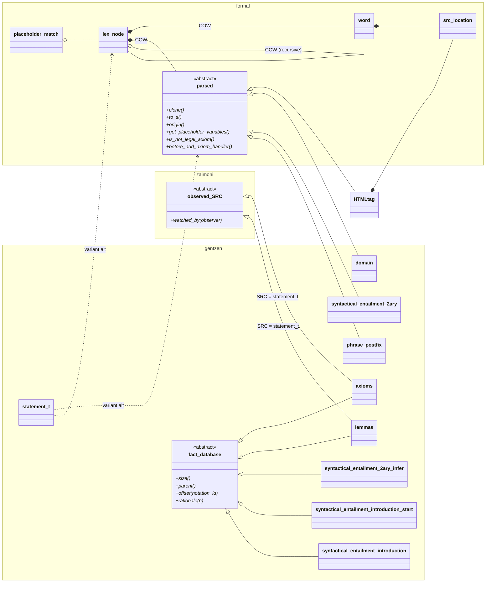

# GentzenW class hierarchy

Scope: classes reachable from the GentzenW translation unit
([GentzenW.cpp](GentzenW.cpp), [HTMLtag.cpp](HTMLtag.cpp), and the
`z_kuroda` library). Classes used only by Franci/Franci_console/LogicC
are out of scope.

## Standalone classes (no inheritance, included for completeness)

| Class | File | Role |
|-------|------|------|
| `formal::is_wff` | [GentzenW.cpp:330](GentzenW.cpp:330) | Well-formed-formula predicate |
| `gentzen::argument_enforcer` | [GentzenW.cpp:451](GentzenW.cpp:451) | Argument-shape validation (final) |
| `gentzen::symbol_catalog` | [GentzenW.cpp:859](GentzenW.cpp:859) | Symbol registry / global parse |
| `gentzen::notation_ids` | [GentzenW.cpp:1471](GentzenW.cpp:1471) | Notation ID lookup (final) |
| `gentzen::tag_placeholder_syntax` | [GentzenW.cpp:1561](GentzenW.cpp:1561) | Tags placeholder-variable syntax |
| `gentzen::collect_placeholder_handles` | [GentzenW.cpp:1595](GentzenW.cpp:1595) | Walks parse trees collecting placeholders |
| `undefined_SVO` | [GentzenW.cpp:2899](GentzenW.cpp:2899) | Subject-Verb-Object placeholder |
| `error_counter<T>` | [errcount.hpp:9](errcount.hpp:9) | Threshold-based error counting |
| `kuroda::parser<T>` | Zaimoni.STL/LexParse | Kuroda-normal-form parser (template) |

## Out of scope (utility infrastructure, not part of GentzenW's design)

`zaimoni::COW`, `zaimoni::cache` / `I_erase`, the `auto*ptr` family, and
`zaimoni::stack` — these are Zaimoni.STL containers/smart-pointers that
GentzenW *uses* but that aren't part of its class hierarchy. If a
separate Zaimoni.STL infrastructure diagram becomes useful later, it
can live in its own file.
